# Overview of ROS Payroll Reporting

## Overview of ROS Payroll Reporting

## PAYE Modernisation

Version 1.0 Release Candidate 2 Version Date 24/04/2020

### Audience

This document is for any user/software provider who has chosen to use the ROS Payroll Reporting screens as part of PAYE Modernisation.

### Document context

This document provides details for accessing and using the ROS Payroll Reporting screens. These screens provide a user interface for the provision of payroll activities.

### Access

The ROS Payroll Reporting screens are accessed here , using test certificates downloaded from the PAYE PIT Self-Service Application.

|  | Version History |  |  |  |  |  |  |  |  |  |  |
|---|---|---|---|---|---|---|---|---|---|---|---|
|  | Version |  |  | Change Date |  |  | Section |  |  | Change Description |  |
|  | 0.1 |  |  | 05/04/2018 |  |  | All |  |  | Document published. |  |
| 1.0 Release Candidate 2 | 1.0 Release |  | 24/05/2018 | 24/05/2018 |  |  |  |  |  | Version updated to 1.0 Release |  |
|  | Candidate 2 |  |  |  |  |  |  |  |  | Candidate 2 |  |
|  |  |  | 29/04/2019 |  |  | 2 |  |  |  | Added image of view payroll |  |
|  |  |  |  |  |  |  |  |  |  | submission feature |  |
|  |  |  |  |  |  | 5 |  |  |  | Added section describing the view |  |
|  |  |  |  |  |  |  |  |  |  | payroll functionality |  |
|  |  |  | 02/09/2019 |  |  | 3.2.1 |  |  |  | Specified that RPNs for the |  |
|  |  |  |  |  |  |  |  |  |  | following year can be looked up at |  |
|  |  |  |  |  |  |  |  |  |  | any time in the PIT next version |  |
|  |  |  |  |  |  |  |  |  |  | environment |  |
|  |  |  |  |  |  | 3.2.1 |  |  |  | Specified that employment ID is |  |
|  |  |  |  |  |  |  |  |  |  | not required for specific employee |  |
|  |  |  |  |  |  |  |  |  |  | RPN lookup in PIT next version |  |
|  |  |  | 01/11/2019 |  |  | 3.3 |  |  |  | Updated returned RPN screen to |  |
|  |  |  |  |  |  |  |  |  |  | show Cessation Date field for PIT |  |
|  |  |  |  |  |  |  |  |  |  | next version. |  |
|  |  |  | 02/03/2020 |  |  | 3.2.1 |  |  |  | Employment ID not required for |  |
|  |  |  |  |  |  |  |  |  |  | either environment |  |
|  |  |  | 24/04/2020 |  |  | 3 |  |  |  | Updated figure 2 to include |  |
|  |  |  |  |  |  |  |  |  |  | Temporary Wage Subsidy Scheme |  |
|  |  |  |  |  |  |  |  |  |  | link |  |
|  |  |  |  |  |  | 3.5 |  |  |  | Added section on Temporary |  |
|  |  |  |  |  |  |  |  |  |  | Wage Subsidy Scheme |  |

### Table of Contents

## 1. Introduction

This is a brief user manual providing an introduction to the ROS Payroll reporting screens. These screens provide a user interface for the provision of payroll activities. ROS Payroll reporting is a supporting application of the PAYE Modernisation project. The access point for these screens will be via ROS. The tests certs downloaded from the PIT Self Service application are used to login to these screens.

## 2. Employer Services

The Employer Services main page is the entry point for two main payroll functions:

- RPN Requests

- Payroll Submissions

- View Payroll Submissions

Employer Services is accessed through ROS.

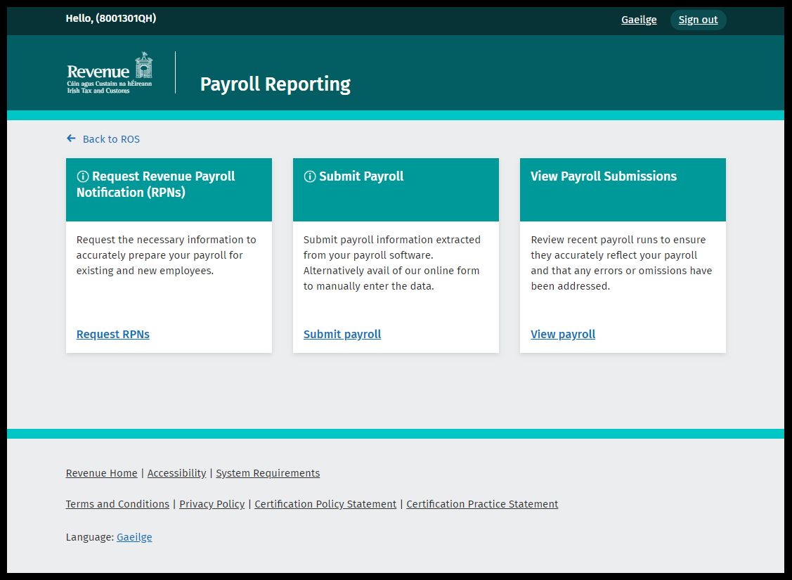

Figure 1 Employer Services dashboard

Employers that have multi PREM registrations will have an option on screen where they can select the PREM number they wish to proceed with.

Informational (info) icons are displayed on the Request Revenue Payroll Notification (RPN) title and the Submit Payroll title. The info icons detail the legislative meanings of RPNs, the information that is contained on the RPN issued by Revenue and information for the users on submission of their payroll.

## 3. Request Revenue Payroll Notifications (RPNs)

Upon selecting “Request RPNs” link, the user will be presented with the RPN landing screen. Here, the user can select whether they wish to request RPNs by file upload or by completion of an online form.

As part of the Temporary Wage Subsidy Scheme (TWSS), users may also download a csv file for a calculation of the maximum subsidy payment amount for each employee.

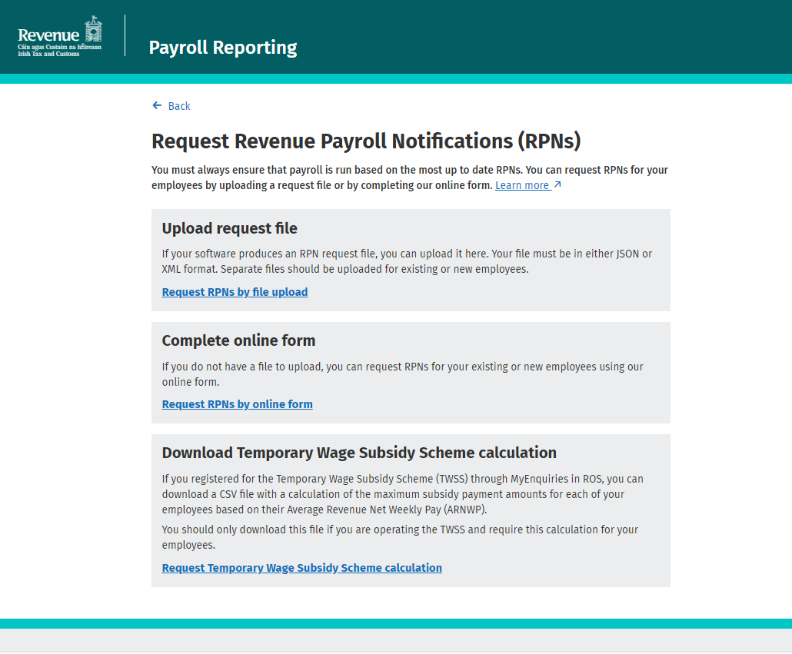

Figure 2 RPN Landing screen

The text states that users must always ensure that the payroll is run based on the most up to date RPNs. This is documented in legislation and a Learn More link has been included on the screen to inform employers of their legal obligations in this regard.

The user is informed of the two ways to request an RPN for an employee. If “Upload request file” option is utilised, the software and format of the request file is outlined. Please note, if the user wishes to upload a request file, they must upload separate files for existing employees or new employees.

When retrieving RPNS for existing employees, RPNs will be automatically issued as there is a Revenue record of the live employment. In the case of new employees, the employment must be registered prior to the RPN being issued. Additionally in some cases, the individual may not have a Revenue profile which will necessitate the individual registering themselves on Jobs and Pensions.

### 3.1 Request RPNs – Upload request file

Upon selecting the “Request RPNs by file upload” link, the user is prompted to upload the request file in the advised format (JSON or XML) to retrieve RPNs for existing or new employees. Separate files must be uploaded for existing or new employees.  A Learn More link on this page gives more information to the user with regard to the acceptable software formats.

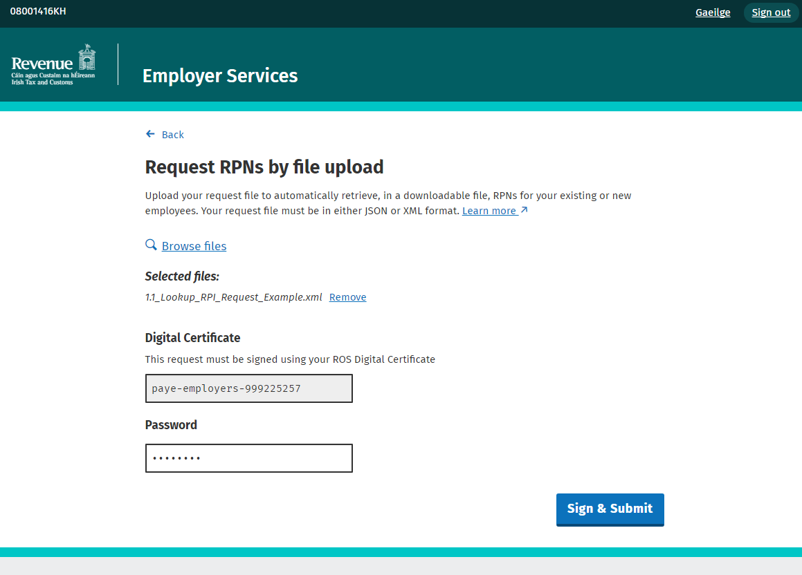

Figure 3 Request RPNs by File Upload screen

The user selects the “Browse files” link to upload their RPN request file from their local drive or a drive of their choice. Once a file is uploaded, the file name will display under “Selected files”. A “Remove” link will display beside the file where the user can remove that file if they so wish. Please note, a user is currently only allowed to submit one RPN request file at a time. There is also a 10MB size limit on files.

The digital certificate field is pre populated with the name of the digital certificate the user logged in with and the user will need to input their password. Upon clicking “Sign & Submit” button, the system verifies that the password is correct and the file is processed. The user is returned the results of their RPN request.

### 3.2 Request RPNs – Complete online form

Requesting RPNs by online form is an option for users who wish to request RPNs for a specific subset of employees or for users who do not use payroll software and choose to use a manual method of pulling down their employees RPNs.

Upon selection of the “Request RPNs by online form” link, the user is presented with a new screen.
The user chooses if they would like to request RPNs for new or existing employees. For more information around the differences between existing and new employees, there is a “Which Should I Choose” informational link.

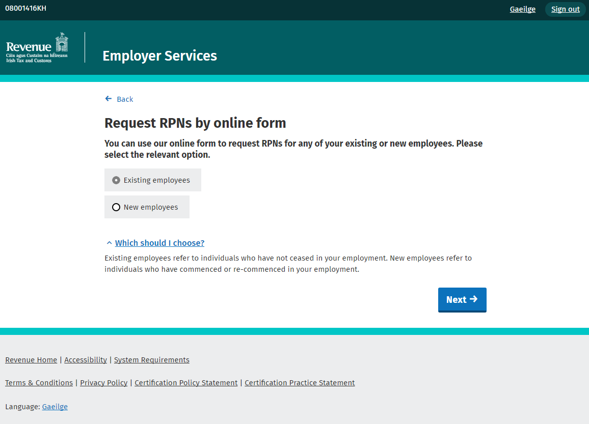

Figure 4 Request RPNs – New or Existing Employees screen

### 3.2.1 Request RPNs – Complete online form (existing employees)

On this screen, users will be able to request RPNs for all employees or for a specific subset of employees.

The current tax year will be the default year and there will be no facility to request RPNs for back years. In the month of December the next tax year will be available to select. This will provide the facility to download RPNs for the coming tax year as well as the current tax years. In the PIT next version environment, it is possible to look up RPNs for the following year in any month.

The user can also make a request for any RPNs which have been updated since they last ran their payroll. The user will be prevented from inputting a date after the current date into this field.

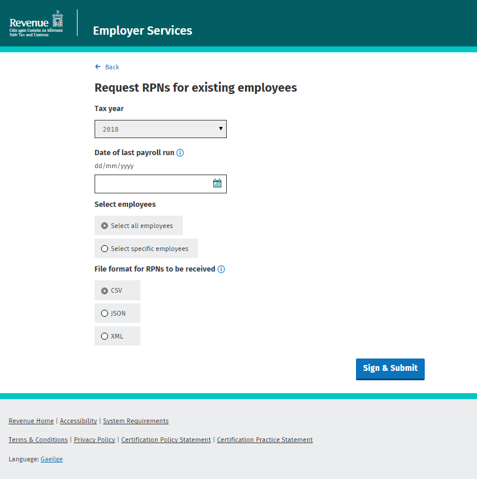

Figure 5 Request RPNs for Existing Employees

The user is required to select the employees they wish to request RPNs for. They can either select all employees or specific employees. In order to request RPNs for specific employees, the user will need to input the PPSN and Employment ID of the employee then select “Add”. The employees they outline will then list under the “Selected employees” section.

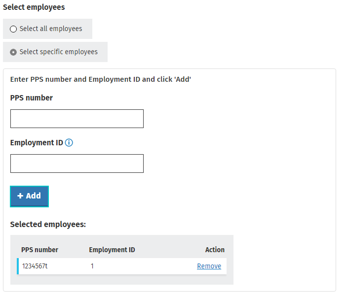

Figure 6 Request RPNs for Specific Existing Employees

The employment ID field is optional for a specific employee RPN lookup. If the employment ID is not specified, RPNs for all employments with that employer will be returned for the employee. If the employment ID is specified, only the RPN for that specific employment will be returned.

Once the user has added all the employees they wish to request RPNs for, they are required to select the file format in which they wish to receive the returned RPNs in i.e.  CSV, JSON or XML.

The user then clicks the “Sign & Submit” button and is brought to the Sign & Submit screen. The digital certificate field is pre populated with the name of the digital certificate the user logged in with and the user will need to input their password. Upon clicking the “Sign & Submit” button, the system verifies

that the password is correct and the file is processed. The user is returned the results of their RPN request.

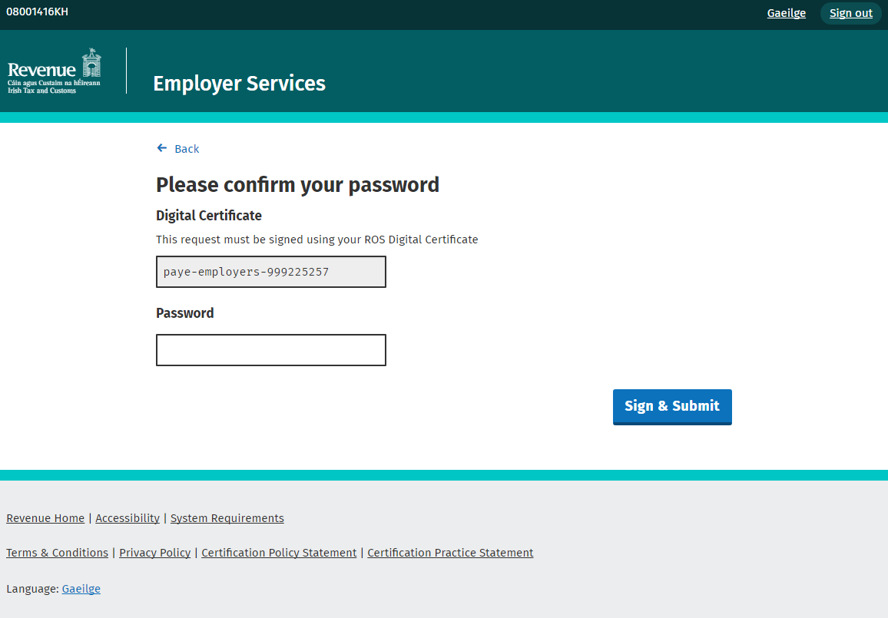

Figure 7 Request RPNs - Sign and Submit

### 3.2.2 Request RPNs – Complete online form (new employees)

On this screen, users will be able to request RPNs for new employees or employees who are recommencing in the users employment. The current tax year will be the default year and there will be no facility to request RPNs for back years. In the month of December the next tax year will be available to select. This will provide the facility to download RPNs for the coming tax year as well as the current tax years.

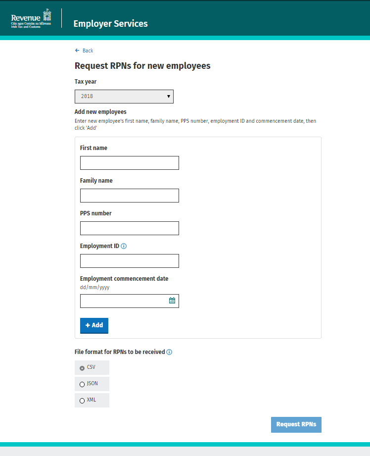

Figure 8 Request RPNs for New Employees

To add new employees, the user will need to provide the employees First name, Family name, PPSN, Employment ID and Employment commencement date. The First name, Family name, PPSN and the Employment ID are mandatory whilst the Employment commencement date is an optional field. When the user has input the employee details, they click the “Add” button. The employees they outline will then list under the “New employees” section.

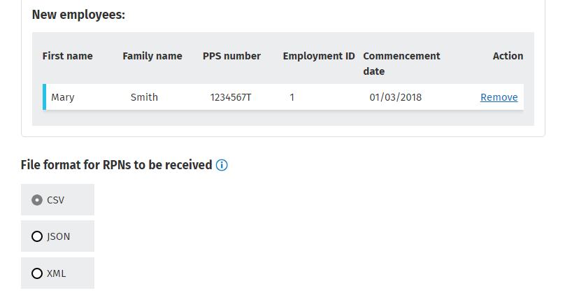

Figure 9 Request RPNs for Specified New Employees

Once the user has added all the employees they wish to request RPNs for, they are required to select the format in which they wish to receive the RPN request in i.e.  CSV, JSON or XML.

They then click the “Sign & Submit” button and are brought to the Sign & Submit screen. The digital certificate field is pre populated with the name of the digital certificate the user logged in with and the user will need to input their password. Upon clicking the “Sign & Submit” button, the system verifies that the password is correct and the file is processed. The user is returned the results of their RPN request.

Figure 10 Request RPNs - Sign and Submit

### 3.3 Request RPNs – Summary Screen

After signing and submitting, the user is presented with a summary screen detailing the results of their RPN request. Depending on their method of submitting their RPN request, the user will get one of two summary screens.

The user will get the following summary screen if they request RPNs by file upload or if they select all employees through the online form for existing employees:

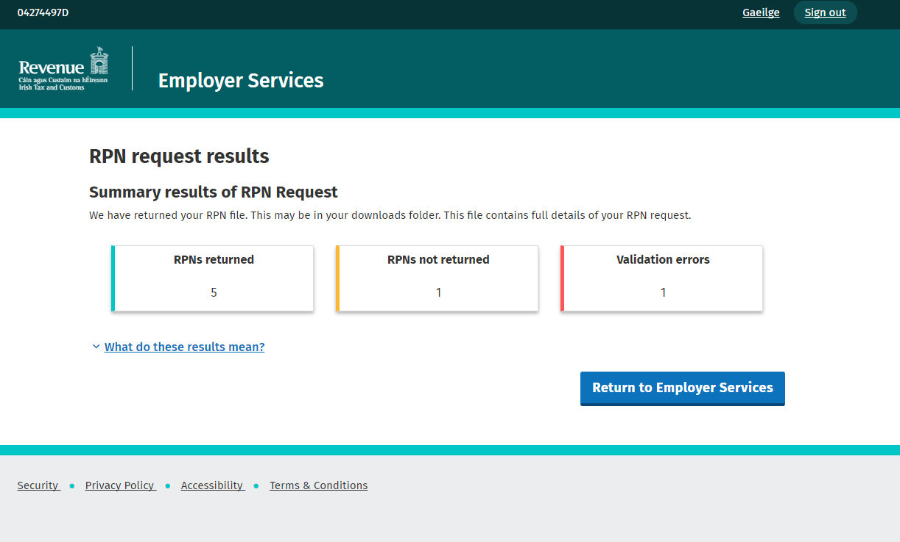

Figure 11 Request RPNs Summary screen (Overview)

| This screen makes the user aware of how many RPNs on their request were successful. The three |
|---|
| possible outcomes are: |
| • RPNs not returned - This is the number of employee RPNs that were not returned |
| • Validation errors – This is the number of validation errors in the request |

| An RPN response file is automatically downloaded for the user in their selected file format which |
|---|
| details the outcome of the RPN request. The user can then input this file to their payroll software in |
| order to complete the next stage of their payroll process. |
|  |
|  |
|  |
| The other summary screen the user may get is if they have completed the online form to request RPNs |
| for new employees or requested RPNs for a specific subset of existing employees: |

|  |  |
|---|---|

| This screen will make the user aware of how many RPNs on their request were successful. The three |
|---|
| possible outcomes are: |
| • RPNs not returned - This is the number of employee RPNs that were not returned |
| • Validation errors – This is the number of validation errors in the request |

| An RPN response file is automatically downloaded for the user in their selected file format which |
|---|
| details the outcome of the RPN request. The user can then input this file to their payroll software in |
| order to complete the next stage of their payroll process. |

On this screen, the user can click on a line of an RPN returned which will invoke a pop up displaying a more detailed view of the RPN which has been retrieved:

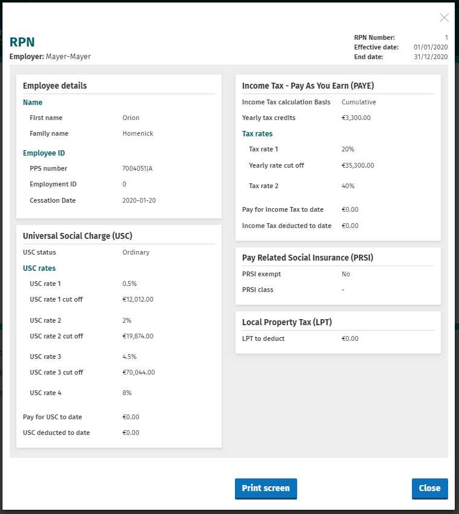

Figure 13 Request RPNs Summary screen (Pop Up)

## 3.4 Request RPN – Rejection Screens

### 3.4.1 Incorrect File Uploaded

If a user attempts to upload a payroll submission file through the RPN request screens, they will be presented with an error screen and blocked from proceeding:

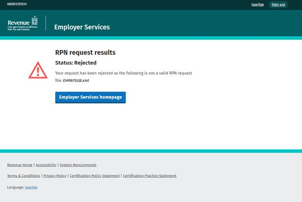

Figure 14 Request RPNs Rejected screen

The user must re-enter the request RPN screens and submit a valid RPN request in order to proceed.

### 3.4.2 Invalid File Uploaded

If the user attempts to upload an RPN request containing content outside of the requirements of the PMOD schema, the file will be rejected and an error screen will be displayed to the user:

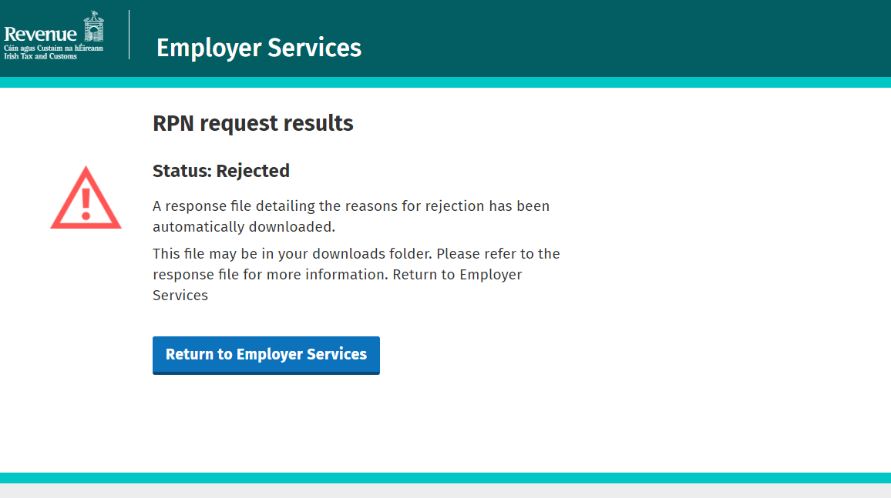

Figure 15 Request RPNs Rejected screen

## 3.5 Temporary Wage Subsidy Scheme

Upon selecting the “Request Temporary Wage Subsidy Scheme calculation” link, a page is displayed explaining the purpose of the calculation.  A Learn More link on this page gives more information to the user by way of an FAQ on the TWSS.

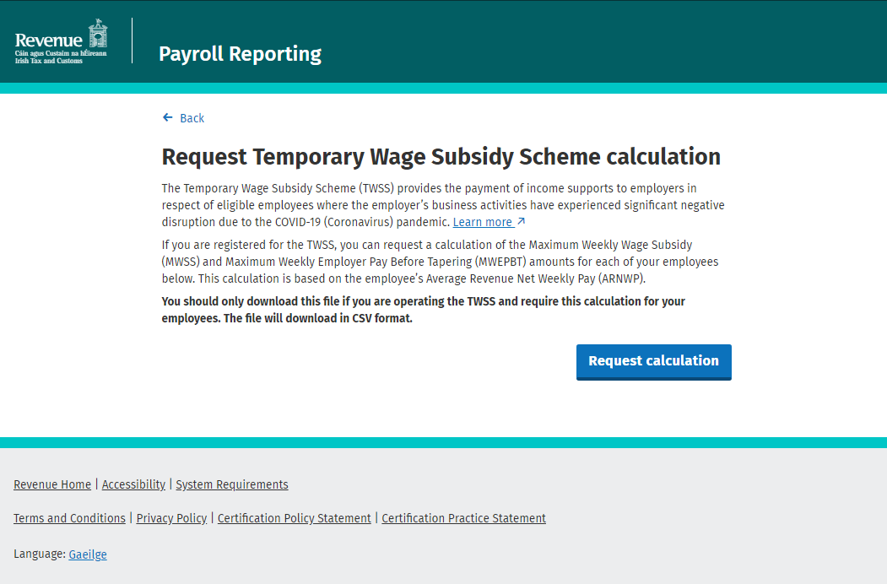

Figure 16 Request Temporary Wage Subsidy Scheme calculation

By clicking the “Request calculation” button the user will be brought to the Sign & Submit screen. The digital certificate field is pre populated with the name of the digital certificate the user logged in with and the user will need to input their password. Upon clicking the “Sign & Submit” button, the system verifies that the password is correct and the file is processed. The user is returned the results of their TWSS calculation in csv format.

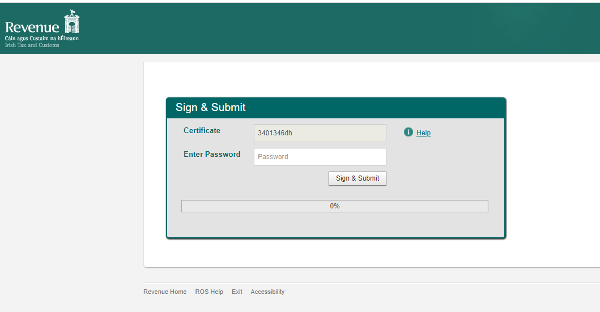

Figure 17 Sign and Submit Screen

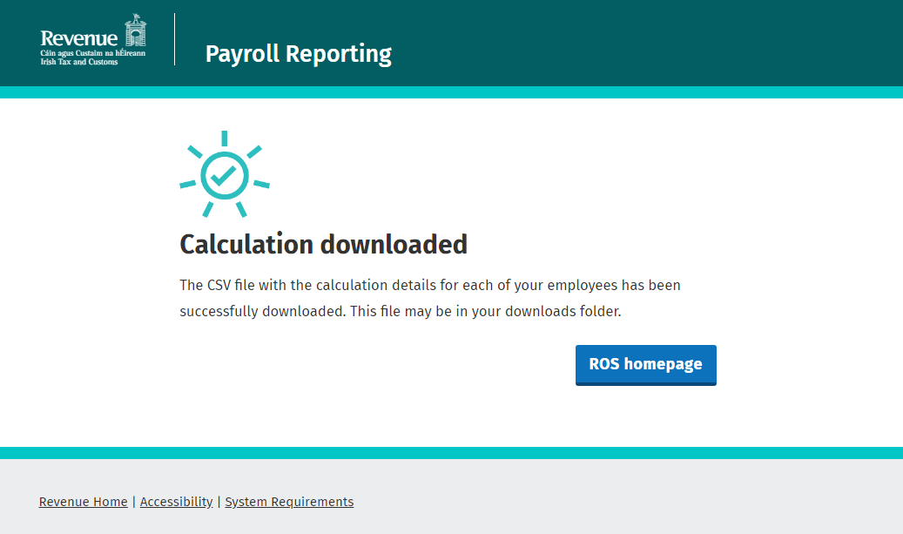

Figure 18 Calculation downloaded screen

## 4. Submit Payroll

Upon selecting the “Payroll submission” link on the Submit payroll card (on the employer dashboard), the user will be presented with the payroll landing screen. Here, the user selects whether they wish to submit payroll by file upload or by completion of an online form.

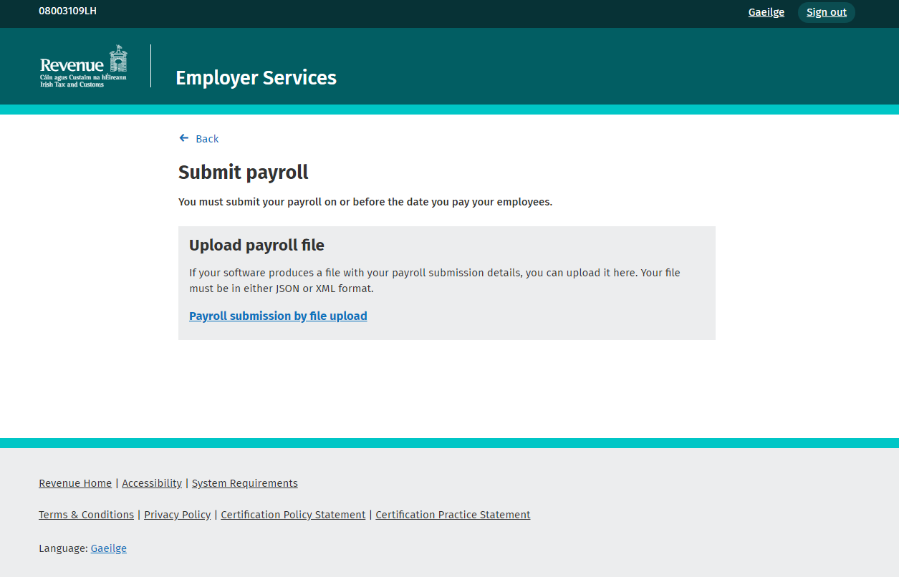

Figure 19 Submit Payroll Landing Screen

## 4.1
## Submit Payroll – Upload Payroll File

Upon selecting to submit payroll by file upload, the user is prompted to upload the payroll submission file in the advised format (JSON or XML). A “Learn More” link on this page gives more information to the user with regard to the acceptable software formats.

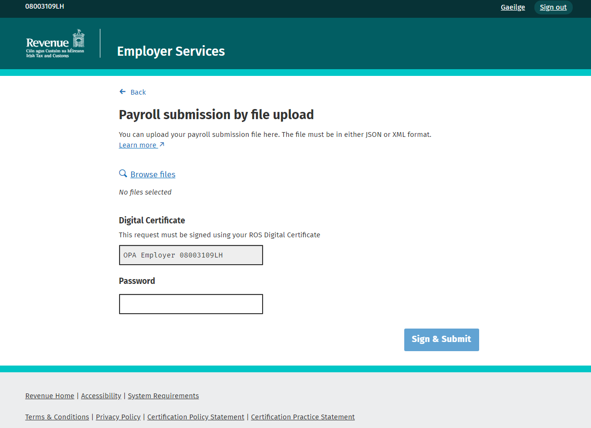

Figure 20 Submit Payroll by File Upload screen

The user selects the “Browse files” link to upload their payroll submission file from their local drive or a drive of their choice. Once a file is uploaded, the file name will display under “Selected files”. A “Remove” link will display beside the file where the user can remove that file if they so wish. Please note, a user is currently only allowed to submit one payroll submission at a time. There is also a 10MB size limit on files.

The digital certificate field is pre populated with the name of the digital certificate the user logged in with and the user will need to input their password. Upon clicking the “Sign & Submit” button, the system verifies that the password is correct and a pop up informing the user that the file is being processed appears.

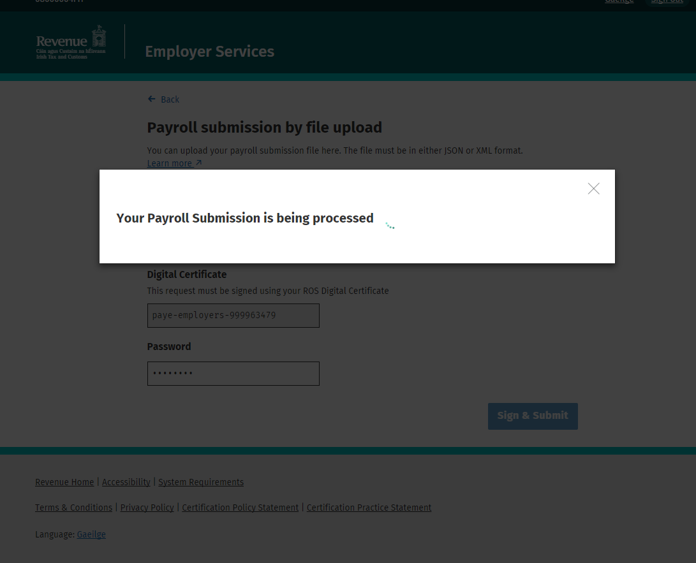

Figure 21 Submit Payroll - File Processing Pop Up

### 4.2 Payroll Submission – Acknowledgement Screen

After the payroll submission file has been accepted and while the file is being processed, the user is made aware that their file has been accepted and the results are being generated. Until the results of the submission are processed, the status displays as “Pending”.

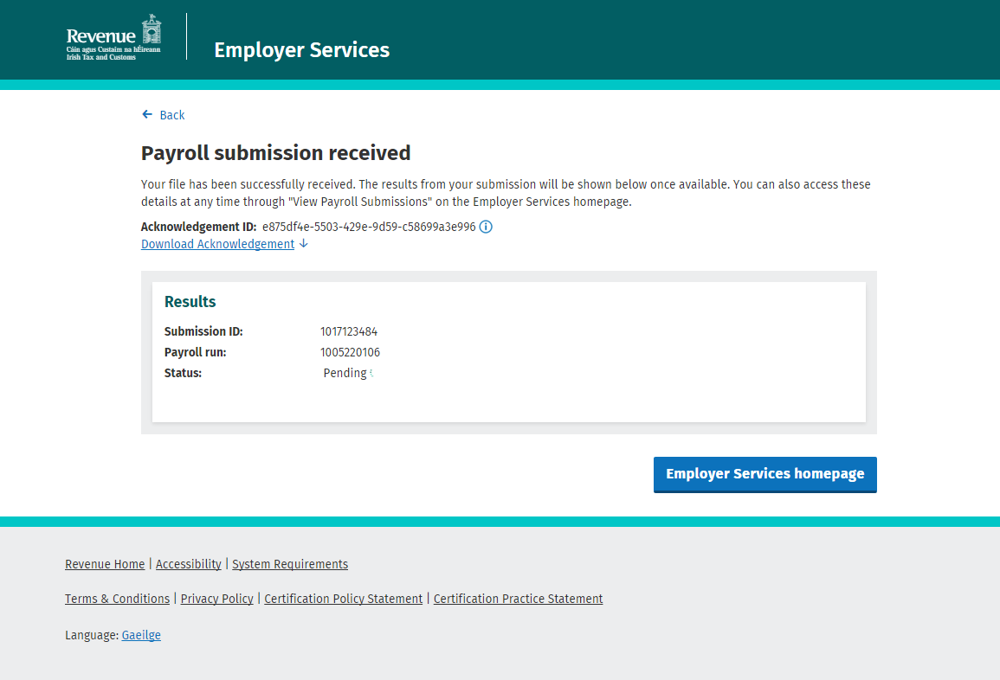

Figure 22 Payroll Submission Received screen

The status of the payroll submission result will display as pending until the payroll submission results are returned. Once the results are returned, a payroll submission response file will be automatically downloaded. This file contains full details of their payroll submission.

### 4.2.1 Payroll Submission – Acknowledgement Screen – Status: Complete

When the results of the payroll submission are generated, the status of the results will change from Pending to Completed.

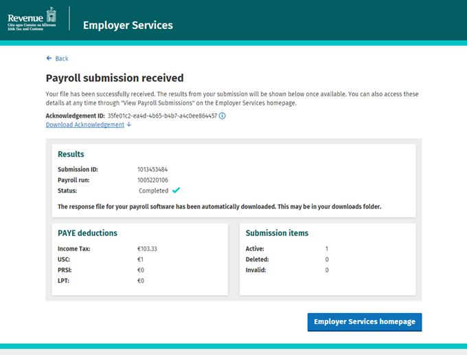

Figure 23 Payroll Submission Received screen – Status: Completed

The user can clearly see that their payroll submission is complete and that there are no errors or warnings associated with their submission.

### 4.2.2 Payroll Submission – Acknowledgement Screen – Status: Complete with
### Warnings and/or Errors

When the results of the payroll submission are generated and if there are warnings or errors associated with the submission, the status of the results will change from Pending to “Complete with warnings” or “Complete with errors”.

If there are warnings associated with the submission, the screen will display as follows:

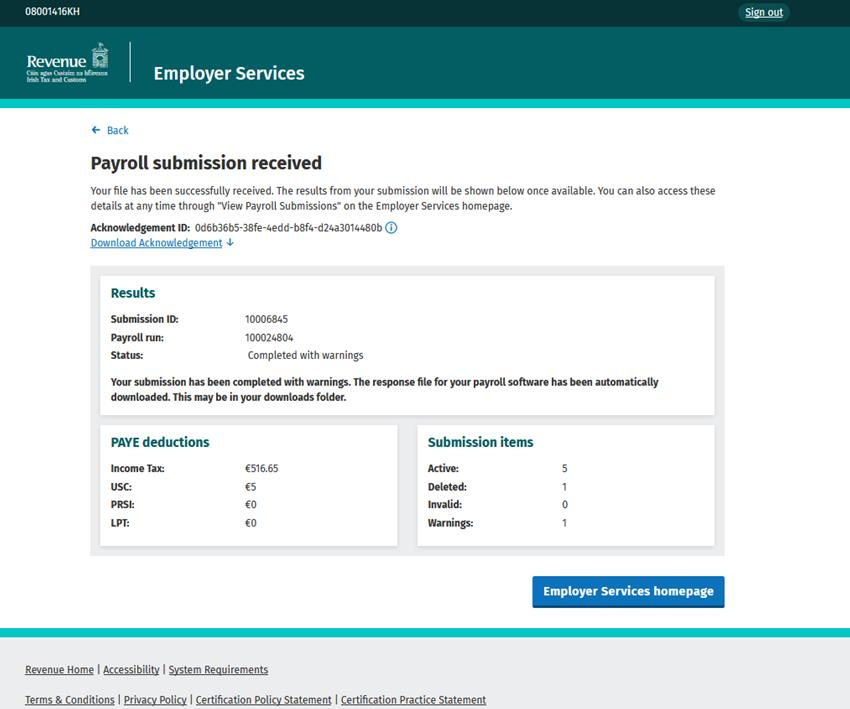

Figure 24 Payroll Submission Received screen – Status: Complete with Warnings

If there are errors associated with the submission, the screen will display as follows:

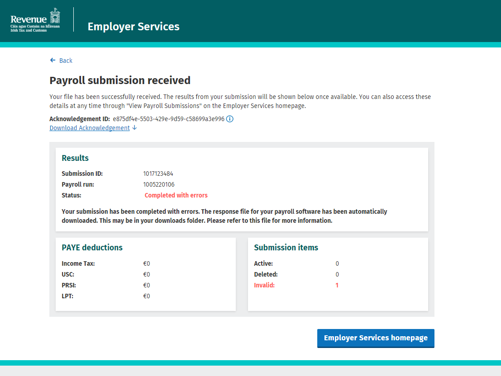

Figure 25 Payroll Submission Received screen – Status: Complete with Errors

If there are errors and warnings on the payroll submission, the screen will display as follows:

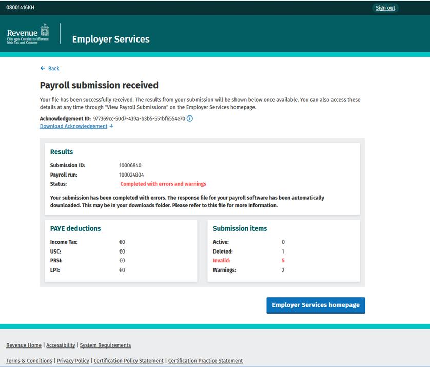

Figure 26 Payroll Submission Received screen – Status: Complete with Errors and Warnings

Full details of these errors and/or warnings will be viewable in the payroll submission response file which is automatically downloaded.

### 4.2.3 Payroll Submission – Acknowledgement Screen – Status: Time Out

If the session times out while the payroll submission results are being generated for the user the status of the submission will displays as “Timed out”. There is a 30 second time out limit. In this scenario, the results of the submission have not been pulled down but the submission has been accepted by Revenue.

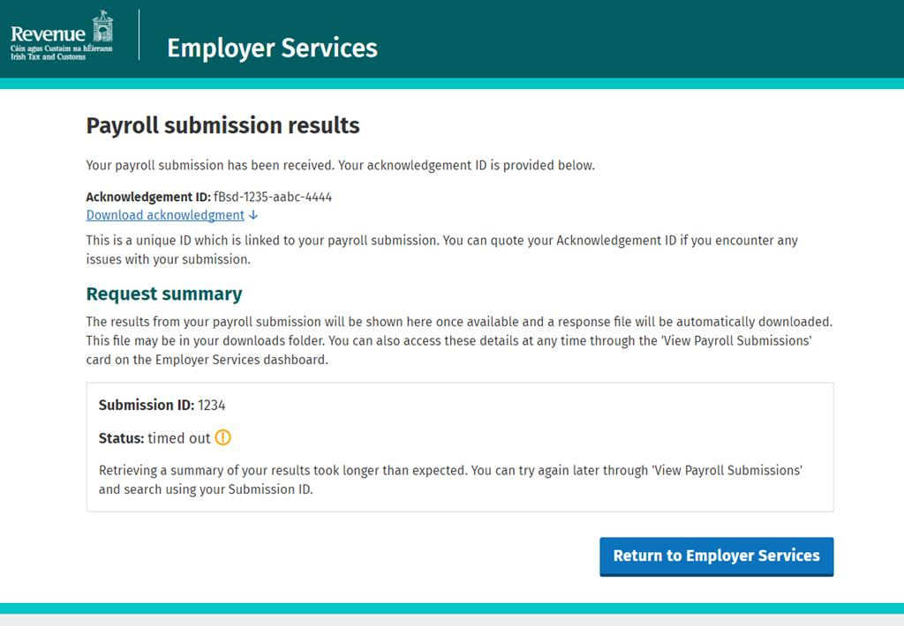

Figure 27 Payroll Submission Received screen – Status: Timed Out

## 4.3 Payroll Submission – Rejection Screens

### 4.3.1 Incorrect File Uploaded

If a user attempts to upload a RPN request through the payroll submission screens, they will be presented with an error screen and blocked from proceeding. The user must re-enter the payroll submission screens and submit a valid payroll submission in order to proceed:

Figure 28 Payroll Submission Received – Rejected screen

### 4.3.2 Invalid File Uploaded

If the user attempts to upload a payroll submission containing content outside of the requirements of the schema, the file will be rejected and an error screen will be displayed to the user:

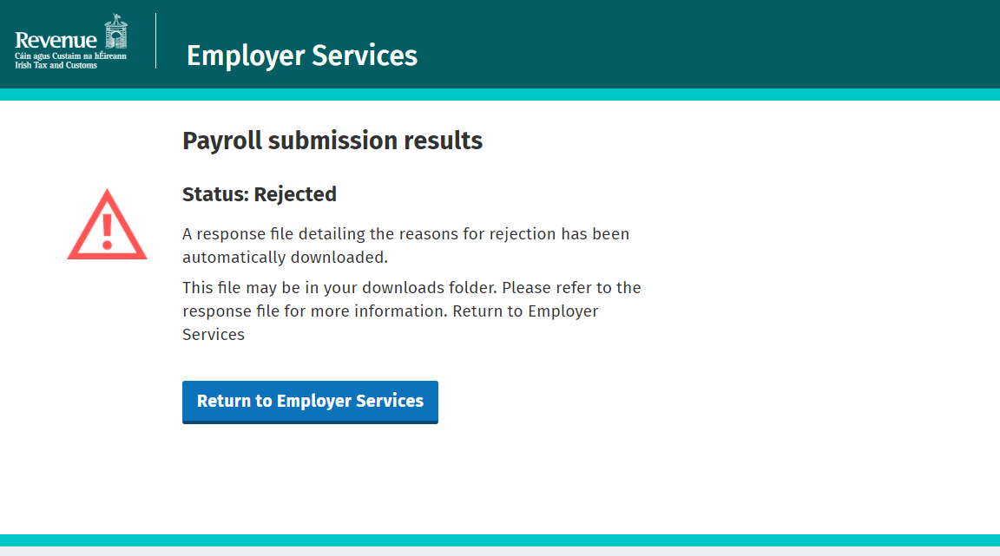

Figure 29 Payroll Submission Received – Rejected screen

## 5. View Payroll

Upon selecting the “View Payroll Submission” link on the employer dashboard, the user will be presented with the view payroll landing screen. Here, the user selects the manner in which they wish to view payroll. The recently updated runs are shown by default but there are several other methods of searching for submissions.

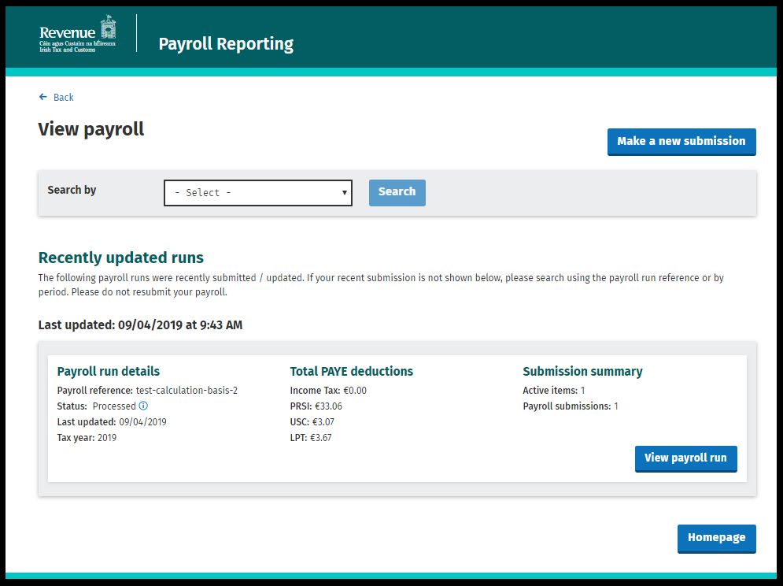

Figure 30: View Payroll Screen

## 5.1 View Payroll – Search by

These are the methods for which a user can search for payroll runs. They are accessed from the dropdown labelled “Search by”.

### 5.1.1 View Payroll – Search by – Recently Updated

This option will show the last 3 payroll runs, by default, the current tax year is selected.

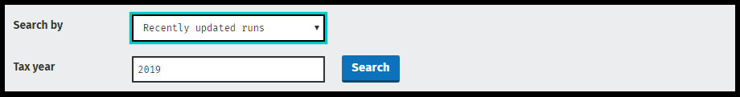

Figure 31: Search by - Recently Updated

### 5.1.2 View Payroll – Search by – Payroll Run Reference

This method allows a user to search for submissions by payroll run reference within a given tax year.
The results list all submissions made under that run reference.

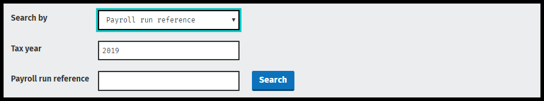

Figure 32: Search by - Payroll Run Reference

### 5.1.3 View Payroll – Search by – Submission ID

This method allows a user to search for submissions by payroll run reference and submission ID within a given tax year. The results list all submissions made under that run reference/submission ID.

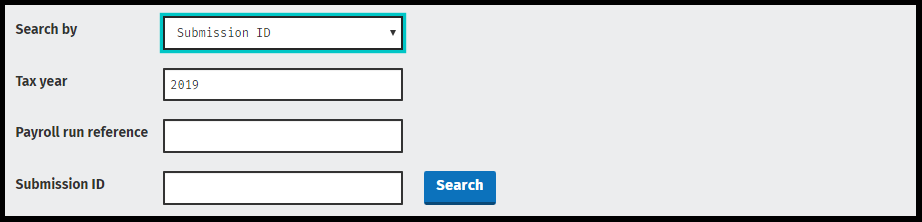

Figure 33: Search by - Submission ID

### 5.1.4 View Payroll – Search by – Period

This method allows a user to search for submissions within a given month. The results list all submissions made within that month.

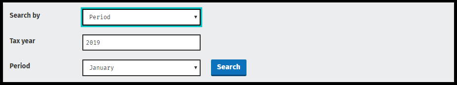

Figure 34: Search by – Period

## 5.2 View Payroll – Payroll Run

When a payroll run is selected, the screen shows any submission/active items made under that payroll run. Details and total values for tax paid within the payroll run are also shown along with a breakdown of total values for each submission.

Each submission within a payroll Run can be selected by clicking the view link under the Action tab.

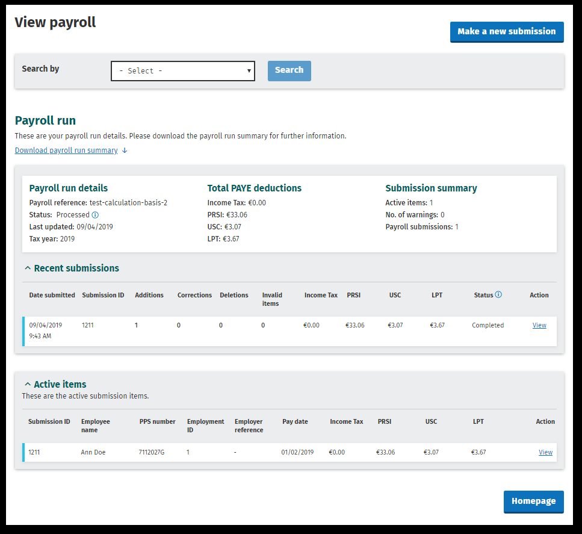

Figure 35: View Payroll - Payroll Run

## 5.3 View Payroll – Payroll Submission

When the user chooses to view a submission, the payroll submission screen is shown. This screen shows the totals of each tax paid from the submission along with a breakdown of each payslip within the submission.
Each payslip within a submission can be selected by clicking the view link under the Action tab.

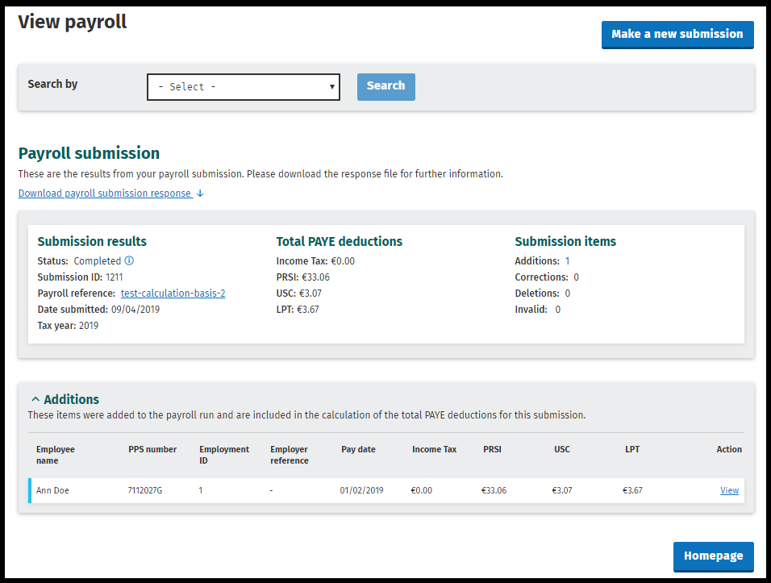

Figure 36: View Payroll - Payroll Submission

### 5.3.1 View Payroll – Payroll Submission – Submission item details

When the user chooses to view a payslip they are presented with the submission item details screen.
From here they can see a breakdown of every item on the payslip and its values. They can also choose to amend any item on the payslip or delete the entire payslip.

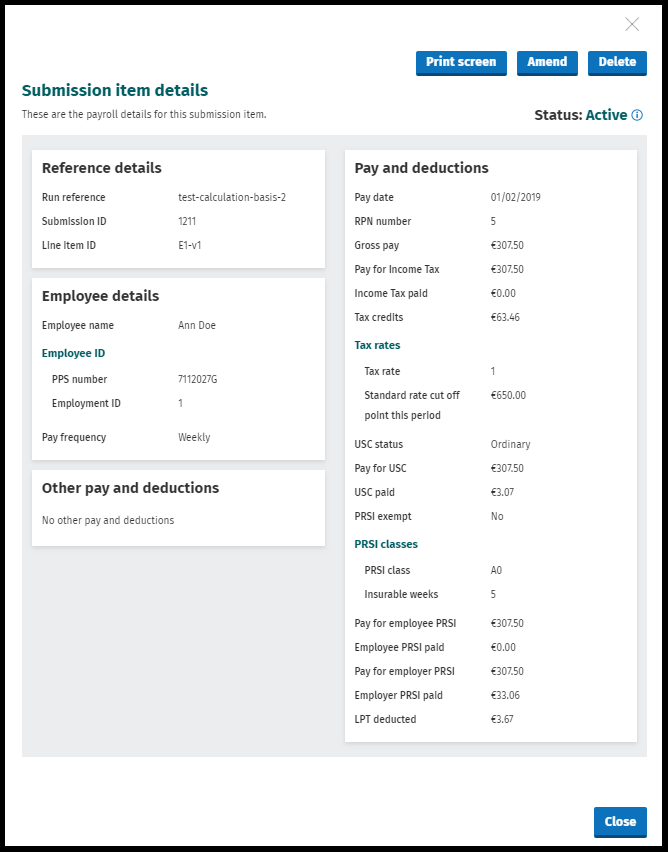

Figure 37: View Payroll – Payroll Submission – Submission item details

### 5.3.2 View Payroll – Payroll Submission – Amend Payslip

The Amend Payslip screen breaks down the payslip into three sections: Employee details, Pay and deductions and Other pay and deductions. By clicking the update link in any of these sections, the user can edit the details of this payslip. Before saving any changes, the checkbox in each section must be ticked to verify that the details of the payslip are correct.

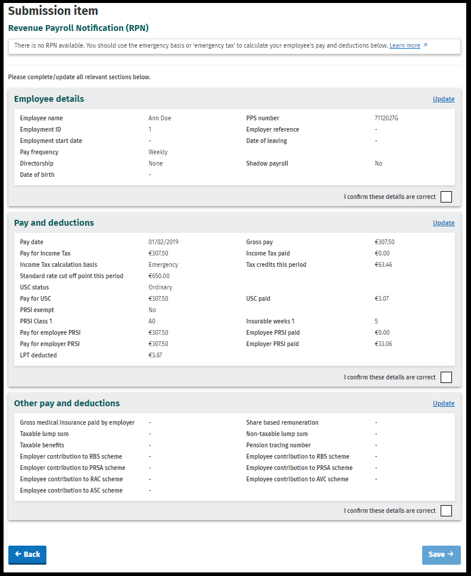

Figure 38: View Payroll – Payroll Submission – Amend Payslip

