# PIT Self Service Application Guide

Version 1.0 Release Candidate 2 Date 13/09/2019

## PIT Self Service Application Guide

## PAYE Modernisation

Audience This document is aimed at payroll software developers and testers who are updating their software packages to be compatible with PAYE reporting obligations from 2019 onwards.

|  | Version History |  |  |  |  |  |  |  |  |  |  |
|---|---|---|---|---|---|---|---|---|---|---|---|
|  | Version |  |  | Date |  |  | Section |  |  | Change Description |  |
|  | 0.1 |  |  | 20/03/2018 |  |  | All |  |  | Initial draft |  |
|  |  |  |  |  |  |  | Appendices |  |  | 7.3 Known Issues section added |  |
| 1.0 Release Candidate 2 | 1.0 Release |  | 25/05/2018 | 25/05/2018 |  |  |  |  |  | Version updated to 1.0 Release |  |
|  | Candidate |  |  |  |  |  |  |  |  | Candidate 2 |  |
|  | 2 |  |  | 29/06/2018 |  |  | Section 7 |  |  | Added |  |
|  |  |  |  | 20/07/2018 |  |  | Section 6.1 |  |  | Added |  |
|  |  |  | 31/07/2018 | 31/07/2018 |  | Appendix | Appendix |  |  | Added Returns Reconciliations |  |
|  |  |  |  |  |  |  |  |  |  | endpoints |  |
|  |  |  | 29/04/2019 |  |  | Section 6 |  |  |  | Added customer with fada |  |
|  |  |  |  |  |  |  |  |  |  | description |  |
|  |  |  | 09/08/2019 |  |  | Section 3 |  |  |  | Added detail about new |  |
|  |  |  |  |  |  |  |  |  |  | employee overview screen and |  |
|  |  |  |  |  |  |  |  |  |  | the new request specific |  |
|  |  |  |  |  |  |  |  |  |  | certificate button |  |
|  |  |  |  |  |  | Section 4.0 |  |  |  | Added section on employee |  |
|  |  |  |  |  |  |  |  |  |  | overview |  |
|  |  |  |  |  |  | Section 4.1 |  |  |  | Added section on edit |  |
|  |  |  |  |  |  |  |  |  |  | employee |  |
|  |  |  |  |  |  |  | Section 5.2 |  |  | Added section on Request |  |
|  |  |  |  |  |  |  |  |  |  | Specific Employee button |  |
|  |  |  | 02/09/2019 |  |  | Section 1 | Section 1 |  |  | Added description of |  |
|  |  |  |  |  |  |  |  |  |  | differences between PIT current |  |
|  |  |  |  |  |  |  |  |  |  | and next versions |  |
|  |  |  |  |  |  |  | Section 2 |  |  | Added image of PIT next version |  |
|  |  |  |  |  |  |  |  |  |  | login |  |
|  |  |  |  |  |  |  | Section 5.2 |  |  | Updated figure to show tax year |  |
|  |  |  |  |  |  |  |  |  |  | 2020 |  |
|  |  |  | 13/09/2019 |  |  |  | Section 1 |  |  | Added link to PIT Next Version |  |
|  |  |  |  |  |  |  |  |  |  | portal login |  |

### TABLE OF CONTENTS

### 1 INTRODUCTION

The purpose of this document is to serve as a guide to use the PIT Self Service Application.  This application provides developers and testers access to exclusive Revenue generated test data that is supported in the PIT environment.

There are two PIT Environments available to software developers, the first PIT environment is a representation of the live environment with functionality kept up to date with the functionality currently available in the live environment. The second PIT environment is the PIT Next Version environment, which will contain upcoming functionality that is pertinent for developers to test their software ahead of the live release.

Each environment has its own link, see below, to be accessed from. The Test Data Management (TDM) certificate provided when granted access to the PIT Helpdesk works for both environments and will provide access to the relevant self-service application.

By using this application developers/testers can:

- Download digital certificates associated with test employers required for conformance testing

- Download JSON files containing data of the test employees associated with each test employer

- Request additional certificates for testing

- Delete test employer data

- Create a test unemployed customer

- Download test agent certificates with a test employer

Each employer subsequently created in each environment exists only in that environment. Employers in the PIT current version environment will have a registration number of 8XXXXXXXH and the cert associated with them will be of the form 9999XXXXX. In the PIT next version environment, employers will have a registration number of 9XXXXXXXH and the cert associated with them will be of the form 8888XXXXX.

The PIT Self Service Application can be accessed at the following URL :
[https://softwa](https://softwa) r e t est.ros.ie/paye-employers-self-service/intro Access to the PIT Next Version Self Service Application can be accessed at the following URL :
[https://softwa](https://softwa) r e t estnextversion.ros.ie/paye-employers-self-service/intro

1.1 Prerequisites In order to access and use the PIT Self Service Application, you need to have completed the registration process for the PAYE Modernisation PIT Help Desk and indicated that you require access to PAYE Modernisation testing.
On completion of the registration process, you will receive a digital certificate and password which will allow access to the PIT self service application.

### 2 LOGGING IN

The login screen requires users to sign in with their Test Data Management (TDM) digital certificate and password provided during the registration process 1 .

In order to make the digital certificate that was issued as part of the PIT registration process available in the ‘Select Certificate’ drop down menu, it needs to be loaded into the web browser. The ‘Manage My Certificates’ link provides a screen that allows users to select the certificate and load it into the web browser.

Figure 1 Login Screen Layout for PIT Current Version

1 Please note that this login screen is shared with the ROS Payroll reporting screens. User’s will be directed to the PIT Self Service application from this login screen if they use the Test Data Management (TDM) digital certificate/password provided as part of PIT registration. However, if they use digital certificates provided by the PIT Self Service application they will be directed to the ROS Payroll Reporting screens.

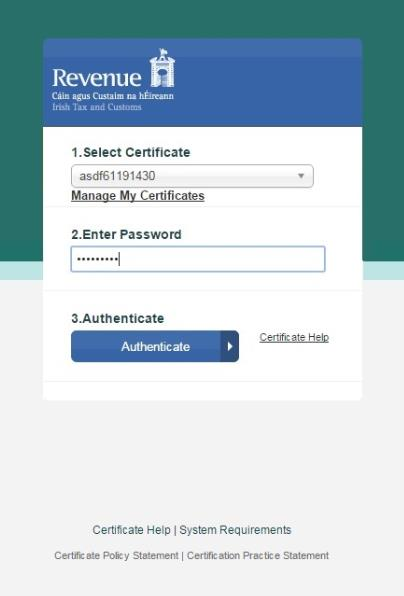

Figure 2: Log in screen layout for PIT Next Version

From the Login screen, a user can use the ‘ Select Certificate’ drop down menu to choose the certificate to use.
Once the appropriate certificate is selected and password is entered, clicking the ‘ Authenticate’ button completes the sign in. On successful sign in the application takes the user to the Introduction screen of the PIT Self Service application.  This screen contains information about the PIT Self Service Application and the PIT testing process.

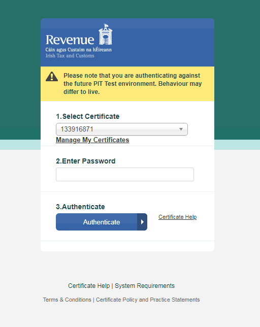

Figure 3  Screen Layout of the Introduction Screen

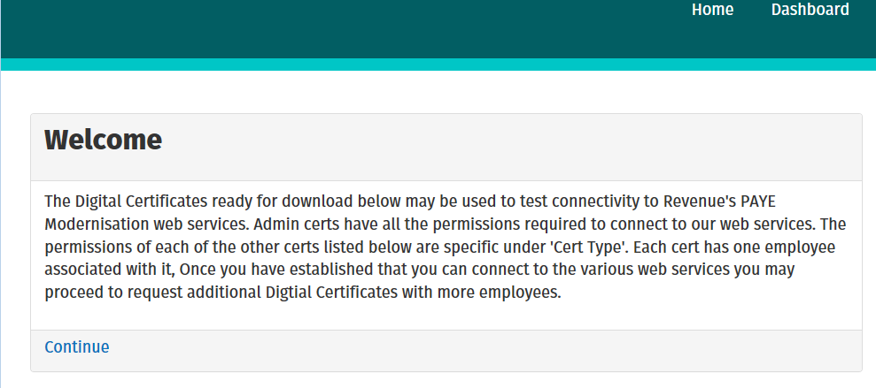

### 3 VIEWING AND DOWNLOADING AVAILABLE TEST DATA

The Dashboard page as seen in Figure 4, displays a table of digital certificates and each row contains:

- The Employer Number associated with the digital certificate

- The number of employees linked to the employer

- A link to download the digital certificate

- The password for the digital certificate

- The digital certificate type and status

- A link to a JSON file which contains Employee details

- First name, Surname and PPSN of all the employees linked to the employer

- A link to an Employee Overview which provides simple overview of employee status and a link to modify employee details

- Name, PPSN, Tac Calculation Basis, USC Status, RPN Type and a link to modify

The screen also allows users to:

- Request New Certificates with random RPNs assigned to each employee.

- Request Specific Certificates with specified RPNs assigned to each employee.

- Delete an employer

- Create an unemployed customer - a PPSN not linked to a digital certificate and so can be used as part of testing the Request New RPN process.

- Create an unemployed customer with a fada guaranteed to be in their name.

- Please note that on first login, the dashboard will contain a single digital certificate however additional certificates can be added by using the ‘Request New Certificates’ or ‘Request Specific Certificates buttons’.

Figure 4 Screen Layout of the Dashboard

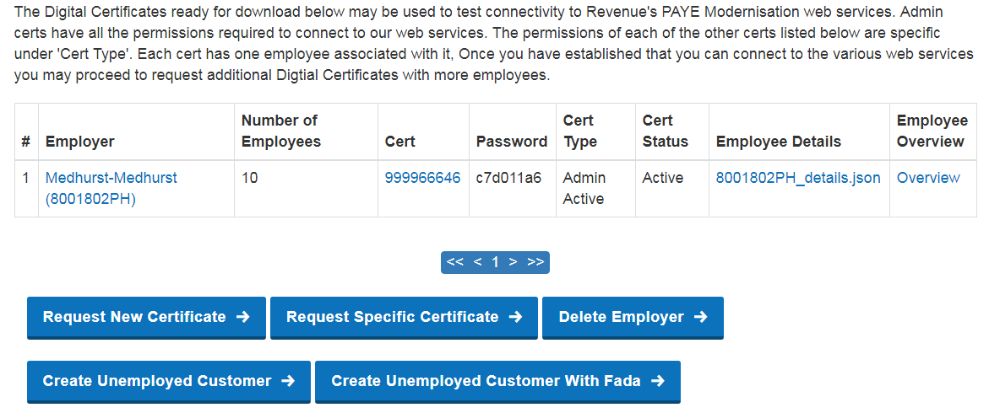

### 4 EMPLOYEE OVERVIEW

The Employee overview page is accessed by clicking either the employer’s name link or the ‘overview’ link on the dashboard. This page shows users an overview of all employees associated with this employer, as seen in Figure 5. By clicking ‘Edit’ in the Modify column of this page, the user can modify the RPN of this specific employee. Any field that is populated with ‘undefined’ has not had that value set yet, which is the case for any employer created using the ‘Request Certificate’ button.

Figure 5

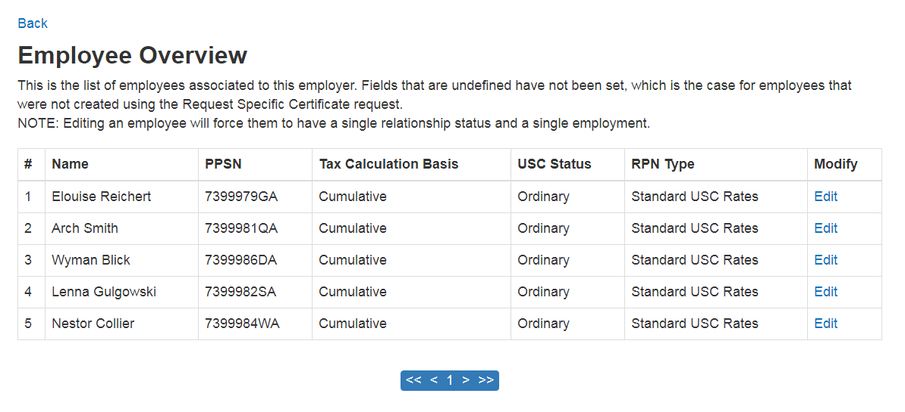

Figure 4 .1 Screen Layout of the Edit Employee

| make the employee to have a single relationship status and a single employment status as these RPN types only |
|---|
| count for such employees. |

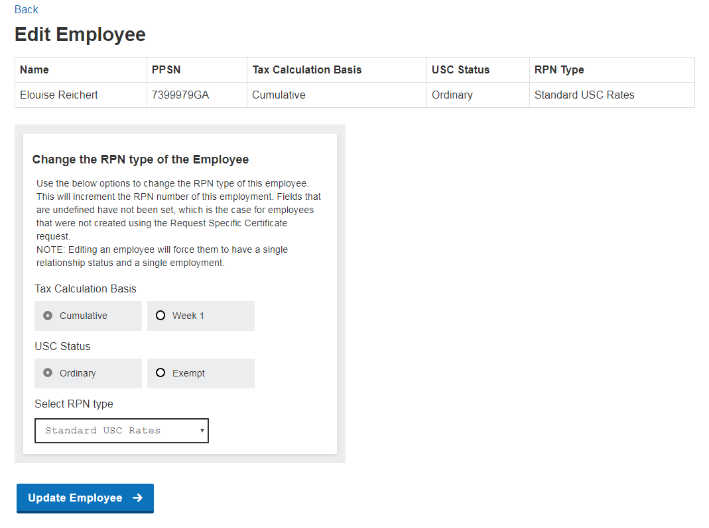

### 5 REQUESTING ADDITIONAL TEST DATA

Users can request a new certificate by clicking the ‘Request New Certificates’ or ‘Request Specific Certificates’ buttons available on the Dashboard.

5.1 Request a new certificate The user can create a new certificate by clicking on the ‘Request a new certificate’ button available on the Dashboard.  The user is brought to a new screen where they can select certificate type and the number of employees required. The new certificate will be created for a new Employer. This certificate and the employee data will be available on the Dashboard. In the PIT4 environment, the default tax year is 2020.

Figure 5 .1 Screen Layout of the Create Custom Certificate

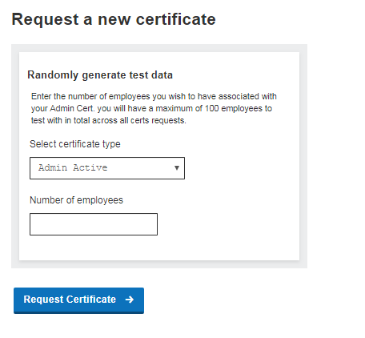

5.2 Request a specific certificate The user can create an employer with employees that have a specific RPN type by clicking on the ‘Request Specific Certificate’ button available on the Dashboard.  The user is brought to a new screen where they can select the number of employees required, the tax calculation basis, USC status, RPN type and previous employment tax details if they need. If previous pay and tax details are not entered, the values will default to 0.
Upon clicking the ‘Request Certificate’ button, the new certificate will be created for a new Employer. This certificate and the employee data will be available on the Dashboard.

Figure 5.2 Screen Layout of Request Specific Certificate

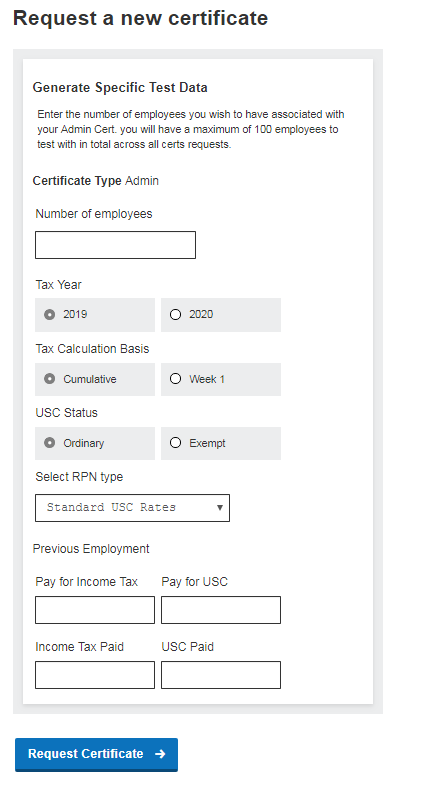

### 6 DELETING TEST DATA

The user can delete test data by clicking on the ‘Delete Employer’ button available on the Dashboard.  The user is brought to a new screen where they can select an Employer Tax Registration Number from the drop-down list and delete all data related to that Employer. The list of Employer Tax Registration Numbers corresponds to the available Employer Tax Registration Numbers on the Dashboard.

Figure 6 Screen Layout of the Delete Employer Screen

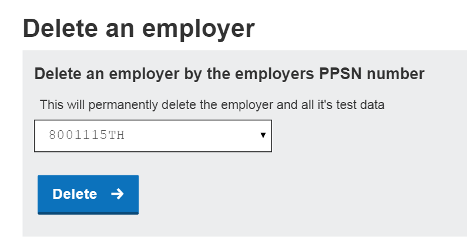

### 7 CREATING UNEMPLOYED CUSTOMER TEST DATA

Users can create test employees who have yet to be associated with any test employment by clicking on the ‘Create Unemployed Customer’ button available on the Dashboard. The user is brought to a new screen where they can view the result 2 of their request to create a new employee not linked to an employment.  Unemployed customers can be used as part of testing the New RPN process.

Figure 7 Screen Layout of the Create Unemployed Customer Screen

Customers who will have a fada in their name can also be created using the self-service application. The process for adding an employment for this new customer is described in the next section.

7.1 Create New RPN for Unemployed Customer

Once you have created an unemployed customer and recorded their details. Create New RPN request should be sent with the details of the unemployed customer to have them added as an employee under an employer.
A Create New RPN request should be submitted before trying to Lookup RPN for that customer. The endpoint to send the request to can be found below in the appendix section.

2 It is recommended that the returned test employee details are noted by the user as clicking the ‘Create Unemployed Customer’ button again will result in a new test employee being displayed here.

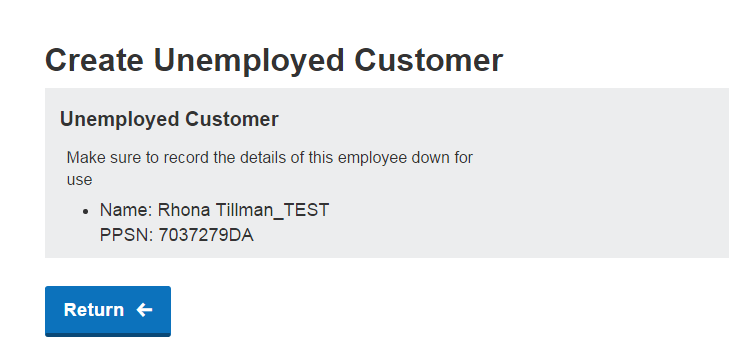

### 8 REQUESTING AGENT CERTIFICATES

Users can request a new Agent certificate by clicking the ‘Request New Certificates’ button available on the Dashboard. They can specify the Agent certificate type and the number of employees required. The new Agent certificate will be created along with a new Employer. This certificate and the employee data will be available on the Dashboard.

Figure 8 Screen Layout of the Create Custom Agent Certificate

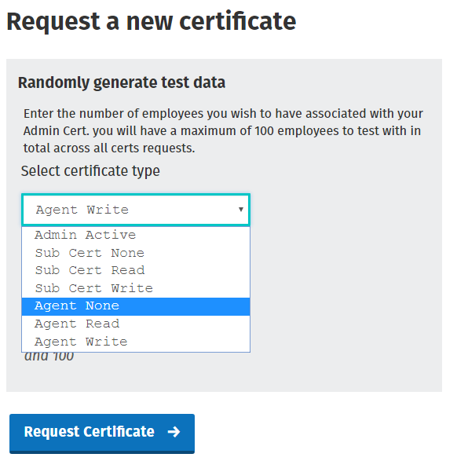

### 9 APPENDIX

This appendix provides the set of REST and SOAP web service endpoints for the Payroll and RPN services available for testing in the Public Interface Testing environment.

9.1 REST API Endpoints

### 9.1.1 RPN Services

[9.1.1.1 POST – Create New RPN https://softwa r e t est.ros.ie/paye- employers/v1/r e s t /rpn/{employerRegistrationNumber}/{taxYear}?softwareUsed={SoftwareName}&softwareVer sion={software V e r sion} Example](https://softwaretest.ros.ie/paye-) employers/v1/r e s t /rpn/00001013N/2018?softwareUsed=abc&softwareVersion=1.0

9.1.1.2 GET – Look Up RPN [https://softwa](https://softwa) r e t est.ros.ie/paye- employers/v1/r e s t /rpn/{employerRegistrationNumber}/{taxYear}?softwareUsed={SoftwareName}&softwareVer sion={software V e r sion}

[Example](https://softwaretest.ros.ie/pa) ye - employers/v1/r e s t /rpn/03390656OH/2018?softwareUsed=1&softwareVersion=1.0

9.1.1.3 GET – Look Up RPN by employee [https://softwa](https://softwa) r e t est.ros.ie/paye- employers/v1/r e s t /rpn/{employerRegistrationNumber}/{taxYear}/{employeeId}?softwareUsed={SoftwareName} &softwareVersi on= {softwareVersion}

[Example](https://softwaretest.ros.ie/paye-employers/v1/rest/rpn/03390656OH/2018/01092485G-) 2?softwareUse d = 1 &softwareVersion=1.0

9.1.1.4 GET – Look Up RPN by employer using optional filters date last updated and/or employee Ids

[https://softwa](https://softwa) r e t est.ros.ie/paye- employers/v1/r e s t /rpn/{employerRegistrationNumber}/{taxYear}?softwareUsed={SoftwareName}&softwareVer sion={software V e r sion}&employeeIDs={employeeId1},{employeeId2}&dateLastUpdated={date}

[Example](https://softwaretest.ros.ie/paye-) employers/v1/r e s t /rpn/03390656OH/2018?softwareUsed=1&softwareVersion=1&employeeIDs=00202020PA- 1,7002439CA-2&d a teLastUpdated=2018-02-01

9.1.2 Payroll Services

9.1.2.1 POST - Payroll Submission

[https://softwa](https://softwa) r e t est.ros.ie/paye-

employers/v1/r e s t /payroll/{employerRegistrationNumber}/{taxYear}/{payrollRunReference}/{SubmissionID}?sof

twareUsed={so ft wareName}&softwareVersion={softwareVersion}

[Example](https://softwaretest.ros.ie/paye-employers/v1/r) e s t /payroll/00087900D/2018/PayrollRun1/Submission01?softwareUsed=abc&softwareVersion=

1.0

9.1.2.2 GET – Check Payroll Submission

[https://softwa](https://softwa) r e t est.ros.ie/paye-

employers/v1/r e s t /payroll/{employerRegistrationNumber}/{taxYear}/{PayrollRunReference}/{SubmissionID}?sof

twareUsed={so ft wareName}&softwareVersion={softwareVersion}

[Example](https://softwaretest.ros.ie/paye-employers/v1/r) e s t /payroll/00087900D/2018/PayrollRun1/Submission01?softwareUsed=abc&softwareVersion=

1.0

9.1.2.3 GET – Check Payroll Run

[https://softwa](https://softwa) r e t est.ros.ie/paye-

employers/v1/r e s t /payroll/{employerRegistration}/{taxYear}/{PayrollRunReference}?softwareUsed={softwareNa

me}&softwareV e r s ion={softwareVersion}

[Example](https://softwaretest.ros.ie/pa) y e-

employers/v1/r e s t /payroll/00087900D/2018/PayrollRun1?softwareUsed=abc&softwareVersion=1.0

9.1.3 Returns Reconciliations [https://softwa](https://softwa) r e t est.ros.ie/paye- employers/v1/r e s t /returns_reconciliation/{employerRegistration}?softwareUsed={softwareName}&periodStart Date={periodSt ar tDate}&periodEndDate={periodEndDate}&softwareVersion={softwareVersion}

[Example](https://softwaretest.ros.ie/paye-) employers/v1/r e s t /returns_reconciliation/03497992DH?softwareUsed=abc&periodStartDate=2019-04- 01&periodEnd Dat e=2019-04-30&softwareVersion=1

9.2 SOAP API Endpoints

9.2.1 RPN Services [https://softwa](https://softwa) r e t est.ros.ie/paye-employers/v1/soap/rpn

9.2.2 Payroll Service [https://softwa](https://softwa) r e t est.ros.ie/paye-employers/v1/soap/payroll

9.2.3 Returns Reconciliations [https://softwa](https://softwa) r e t est.ros.ie/paye-employers/v1/soap/returns_reconciliation

9.3 Known Issues

9.3.1 Self Service Application Login On clicking the ‘register for ROS’ link on the Self Service Application login page in PIT3 a ‘503 service unavailable’ page is displayed to the user.

